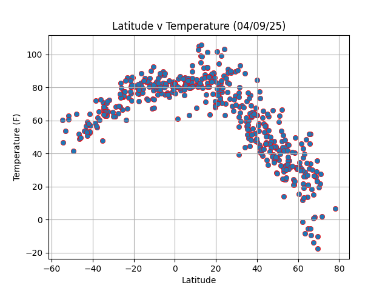

## Overview of Project

## a. WeatherPy

I created a Python script to visualize the weather of over 500 cities of varying distances from the equator using the `citipy` Python library and the OpenWeatherMap API.

Wondering if the temperatures usually do increase on the way to the equator, I generated scatter plots and linear regression models to showcase the following relationships as well:

* Latitude vs. Temperature
* Latitude vs. Humidity

* Latitude vs. Cloudiness
* Latitude vs. Wind Speed

## b. VacationPy

I used my weather data to plan future vacations. I used Jupyter notebooks, the `geopandas` python library, and the Google API to create map visualizations of ideal vacation spots.

1. Clone the repository to your local machine.
2. Install the required libraries: `pandas`, `numpy`, `matplotlib`, `seaborn`, `requests`, `citipy`, and `geopandas`.
3. Obtain API keys for [OpenWeatherMap](https://openweathermap.org/api) and [Google Maps](https://developers.google.com/maps).
4. Create an `.env` file in the project directory and add your API keys as variables.
5. Open the `WeatherPy.ipynb` and `VacationPy.ipynb` Jupyter notebooks to explore the analyses and visualizations.
